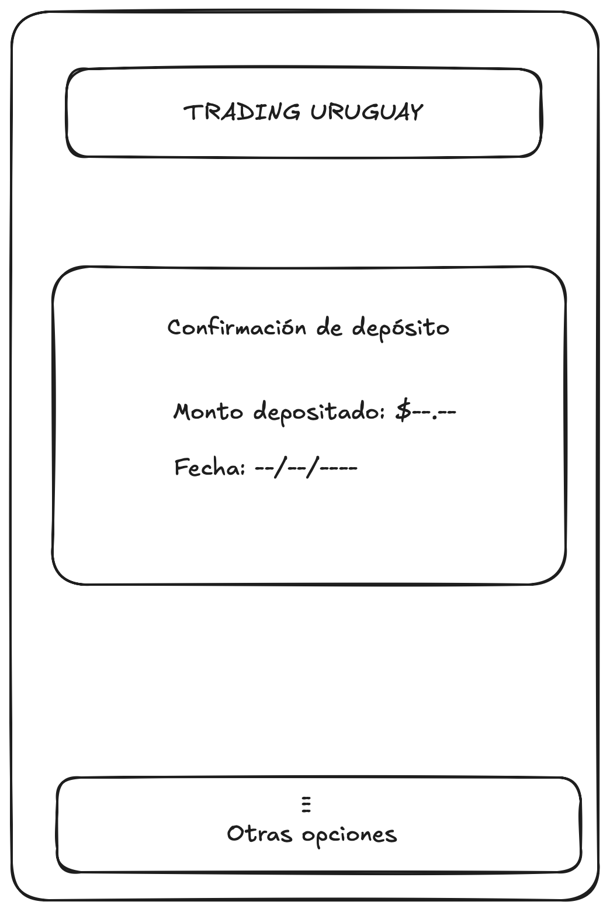
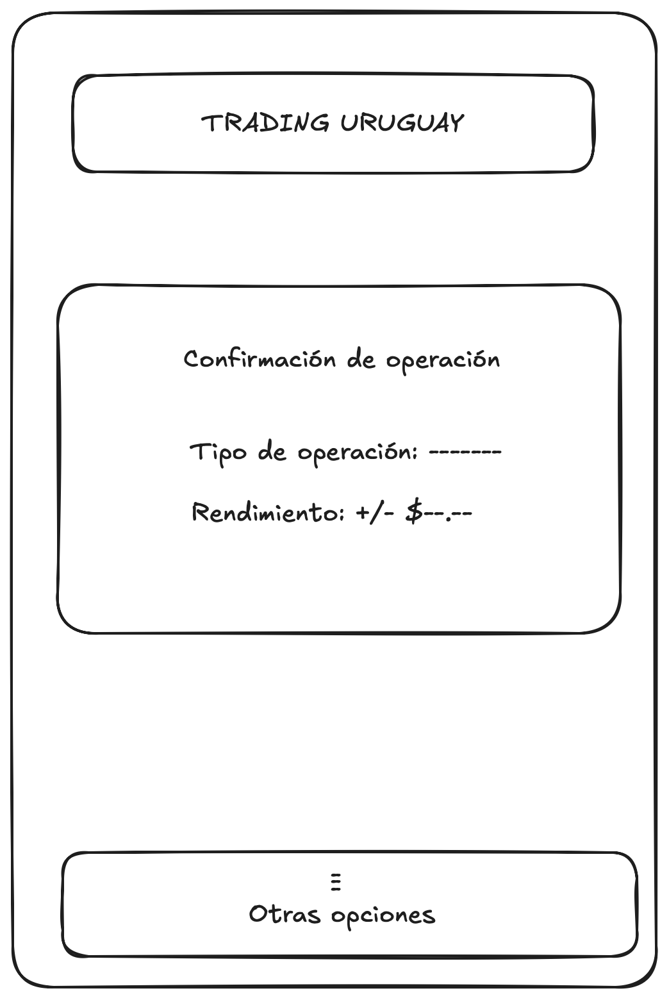
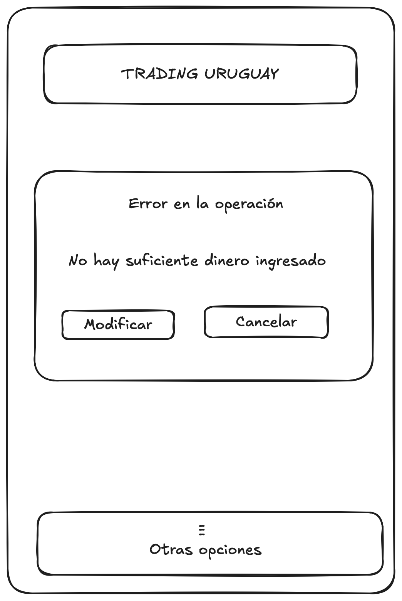
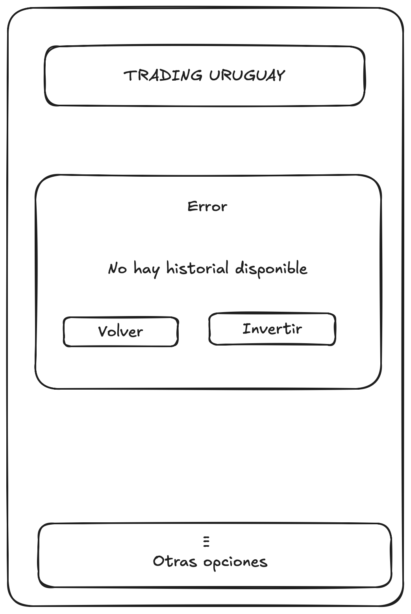
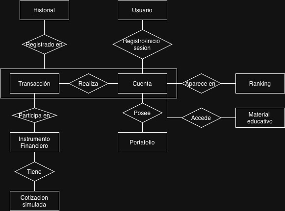

# Informe Académico 1

## Repositorio Git

En el marco del primer Obligatorio de Fundamentos de Ingeniería de Software, se solicitó investigar y desarrollar un proyecto vinculado al mundo del trading.  
Para ello, el equipo implementó un repositorio en GitHub con el objetivo de centralizar el código, la documentación y los recursos asociados al trabajo.  
El principal objetivo de este proyecto es realizar un programa donde los usuarios que lo utilizan puedan "intercambiar valor”.  
El mismo debe permanecer funcionando de manera independiente y sin depender de plataformas de trading o servicios financieros externos existentes en otros países, es decir que solo se centre en los inversionistas uruguayos.

### Estructura del repositorio

El repositorio utilizado para el proyecto fue organizado siguiendo una estructura clara y modular para facilitar la colaboración y el versionado:

- Un directorio docs que contiene toda la documentación, informes y especificaciones del proyecto. Dentro se ven los archivos informe_1 (primer informe para la primera entrega), informe_2 (segundo informe para la segunda entrega) e informe_testing (Informe de testing y calidad del software (Segunda Entrega)). En los tres se detallará todo lo relacionado a la letra de la investigación.
- Un directorio src donde en la segunda instancia del proyecto se desarrollará el código fuente para la aplicación que el equipo hará. En este apartado se implementarán todas las funcionalidades de la investigación para ofrecer una buena aplicación al usuario. En su interior estan las carpetas domain/ que contiene la lógica de negocio principal y sus respectivos tests; e interface/ con los componentes de la interfaz de usuario y la lógica de presentación.
- Un archivo README como en todo repositorio de Git, el cual se detallará más adelante cuál es su utilidad.
- Diversos archivos para las pruebas de testing, actividad que se dictará en instancias futuras dentro del curso.

### Estrategia de branches

Se implementó una estrategia de ramas (branching model) basada en buenas prácticas de desarrollo colaborativo.  
Las ramas principales utilizadas fueron:

- main: rama principal y estable del proyecto. Contiene únicamente versiones funcionales y aprobadas.
- dev: rama de integración y desarrollo continuo, destinada a combinar nuevas funcionalidades antes de su incorporación a main. En este primer obligatorio no fue utilizada, pero se dejó definida para futuros ciclos de desarrollo.
- feature/Juan y feature/Felipe: ramas temporales creadas para el desarrollo de características específicas por cada integrante del equipo. En ellas se realizaron las modificaciones y pruebas correspondientes antes de ser integradas a main mediante merge.
  Cada nueva funcionalidad se desarrolla en una rama feature independiente, que luego se somete a revisión y merge request hacia dev.
  Cada nueva funcionalidad se desarrolla en una rama feature independiente, lo que permite trabajar en paralelo, mantener el historial de cambios limpio y asegurar un proceso de integración controlado y seguro.

### Pautas de commits

Se adoptaron convenciones basadas en Conventional Commits, para mantener un historial claro y semántico.
Ejemplos de los tipos de commits utilizados:

- feat: para nuevas funcionalidades
- fix: para corrección de errores
- docs: para cambios en la documentación
- refactor: para mejoras en el código sin alterar su comportamiento
- test: para la incorporación o actualización de pruebas
  Esta práctica facilita la trazabilidad de los cambios, la generación automática de versiones y la lectura del historial del proyecto.

### README

El archivo README funciona como punto de entrada principal del repositorio y contiene toda la información esencial del proyecto. En él se encuentra:

- Documentación del proycto: presenta donde está ubicada la documentación y objetivos del proyecto y el contexto del trabajo (en este caso, el obligatorio sobre el Trading).
- Estructura del proyecto: se detalla la organización de carpetas y archivos, explicando la función de cada uno dentro del repositorio.
- Recursos adicionales: se enlazan fuentes externas, documentación de referencia y materiales de apoyo relevantes para comprender el trabajo.  
  De esta manera, el README cumple el rol de documento guía, facilitando la comprensión, instalación y mantenimiento del proyecto tanto para los integrantes del grupo como para futuros colaboradores.

---

## Investigación

En una fase anterior a la codificación del trabajo, se debe averiguar lo máximo posible al respecto del tema para poder brindarle al usuario una experiencia óptima en la aplicación.
En primer lugar se debía realizar una entrevista a alguien que esté involucrado en el tema del Traiding. La primera opción siempre fue alguien relacionado con el mundo de la economía, ya que en mayor o menor medida están involucrados en las inversiones. Tras una larga búsqueda se llegó a una persona que tiene un amplio conocimiento sobre las inversiones, que si bien no es un broker profesional, gran parte de su vida la ha dedicado a inveritr su dinero. La profesional es Elisa Moreno, contadora pública, egresada de UdelaR.  
La lista de preguntas ha realizarle fue la siguiente:

1. ¿Cuáles son los instrumentos financieros más comunes en los que invierte un uruguayo promedio?
2. ¿Qué limitaciones existen actualmente para que un pequeño inversionista uruguayo acceda al trading internacional?
3. ¿Qué características o funcionalidades consideran más importantes los inversionistas al usar una plataforma de trading?
4. ¿Qué indicadores financieros básicos deberían mostrarse para evaluar una inversión (por ejemplo, rendimiento, riesgo, liquidez)?
5. ¿Qué nivel de conocimiento financiero suelen tener los nuevos inversionistas en Uruguay?
6. ¿Qué tipo de información o asesoramiento suelen necesitar antes de invertir?
7. ¿Existen barreras regulatorias o legales para desarrollar una plataforma de trading local sin intermediarios extranjeros?
8. ¿Qué errores comunes cometen los inversionistas principiantes al empezar a operar?
9. ¿Cómo podría una aplicación educativa o simulador contribuir al desarrollo del conocimiento financiero en Uruguay?
10. Si existiera una app uruguaya de simulación de inversiones, ¿qué funcionalidades o métricas le parecerían más valiosas para incluir?  
    La especialista consultada indicó que los instrumentos financieros más comunes entre los inversionistas uruguayos son los depósitos a plazo fijo, los fondos de inversión locales, especialmente los vinculados a AFAP y a sectores tradicionales como molinos y ganado, y los inmuebles, que se utilizan principalmente como forma de resguardo de valor.
    En cuanto a las barreras para acceder al trading internacional, destacó la falta de educación financiera y desconocimiento de las plataformas, junto con restricciones bancarias que dificultan transferencias a brokers extranjeros.
    Respecto a las funcionalidades más valoradas en una plataforma, señaló la importancia de que sea fácil de usar, confiable, en español, con acceso a una amplia variedad de instrumentos y datos en tiempo real, incluyendo indicadores de riesgo, rentabilidad, liquidez y apalancamiento.
    La especialista señaló que el nivel de conocimiento financiero promedio en Uruguay es básico, y que los nuevos inversionistas suelen necesitar orientación sobre cómo elegir instrumentos, diversificar y utilizar correctamente las plataformas. Entre los errores más frecuentes mencionó invertir sin comprender los instrumentos, seguir consejos de terceros sin análisis propio, concentrar inversiones en pocos activos y tomar decisiones impulsivas ante cambios del mercado.
    Finalmente, consideró que una aplicación educativa o simulador local sería muy valiosa, ya que permitiría practicar inversiones sin riesgo real, enseñar sobre riesgos y beneficios, ofrecer mentorías guiadas, simulaciones de escenarios y portafolios virtuales, fomentando la educación práctica y contribuyendo al desarrollo del mercado financiero uruguayo.  
    Además, para tener un amplio horizonte sobre qué es lo que esperaría la gente sobre la aplicación y ver que tanto saben y cual es su interés por el tema del Treiding e Inversiones, el equipo realizó una enuesta en Google Forms y se envió a distintos conocidos para que contestaran las preguntas sobre el tema. Las mismas junto con sus respectuvas gráficas se encuentran en un archivo adjunto.
    Con las preguntas realizadas en esta encuesta, se llegó a un verdadero panorama sobre qué es lo que le interesa a la gente que contenga la aplicación y en qué tipo de cosas centrarse en el trabajo.
    El link a la entrevista es el siguiente: https://docs.google.com/forms/d/1YCFq7iz-4Bt2V1v4BXAsjlXA4Y5YhpZj5tvHSIA2Iw0/edit  
    Otro método utilizado fue User Persona. Se realizó para identificar necesidades, motivaciones y frustraciones del usuario, objetivo para diseñar una plataforma educativa de inversión accesible y motivante. Para hacer esto se tomó en cuenta los datos conseguidos con la entrevista.
    A continuación se encuentra el ejemplo.  
    

---

## RF & RNF (Requisitos Funcionales y No Funcionales)

### RF (Requisitos Funcionales)

- RF1  
  Título: Registro y autenticación de usuarios  
  Descripción: El sistema debe permitir registrar nuevos usuarios e iniciar sesión mediante correo y contraseña  
  Actor/es: Usuario  
  Prioridad: Alta
- RF2  
  Título: Gestión de perfil de usuario  
  Descripción: El usuario podrá modificar su información personal, alias y contraseña  
  Actor/es: Usuario  
  Prioridad: Media
- RF3  
  Título: Simulación de compra/venta  
  Descripción: El sistema debe permitir la simulación de compra y venta de instrumentos financieros virtuales (acciones, bonos, fondos y los demás mencionados)  
  Actor/es: Usuario  
  Prioridad: Alta
- RF4  
  Título: Gestión de portafolio  
  Descripción: Cada usuario debe poder visualizar las inversiones actuales, su valor y evolución  
  Actor/es: Usuario  
  Prioridad: Alta
- RF5  
  Título: Historial de transacciones  
  Descripción: El sistema registrará todas las operaciones (compras, ventas, fechas, precios simulados)  
  Actor/es: Sistema  
  Prioridad: Alta
- RF6  
  Título: Visualización de cotizaciones simuladas  
  Descripción: Mostrar precios dinámicos simulados de los instrumentos, actualizados periódicamente o por ronda  
  Actor/es: Sistema/Usuario  
  Prioridad: Media
- RF7  
  Título: Ranking de usuarios  
  Descripción: Generar un ranking según rendimiento o capital acumulado  
  Actor/es: Sistema  
  Prioridad: Baja
- RF8  
  Título: Modo educativo  
  Descripción: Incluir materiales, guías o videos sobre conceptos financieros básicos para que los usuarios puedan informarse primero  
  Actor/es: Usuario  
  Prioridad: Baja
- RF9  
  Título: Simulación de indicadores de riesgo y rendimiento  
  Descripción: Calcular métricas  
  Actor/es: Sistema  
  Prioridad: Media

### RNF (Requisitos No Funcionales)

- RNF1  
  Título: Usabilidad  
  Descripción: La interfaz del sistema debe estar diseñada de forma que cualquier usuario, incluso sin experiencia previa, pueda comprender y utilizar las funcionalidades principales sin requerir capacitación adicional. Todos los botones, menús y acciones deben estar claramente etiquetados, ser coherentes en toda la aplicación y contar con retroalimentación visual y/o sonora al ser utilizados. Las rutas de navegación deben ser predecibles, evitando pasos innecesarios para llegar a cualquier funcionalidad principal. Además, la interfaz debe cumplir con principios de accesibilidad, incluyendo contraste adecuado, textos legibles, y soporte para tecnologías asistivas como lectores de pantalla.  
  Prioridad: Alta
- RNF2  
  Título: Rendimiento  
  Descripción: Todas las operaciones básicas (inicio de sesión, registro de usuario, carga de pantallas principales y ejecución de funciones esenciales) deben completarse en un tiempo máximo de 2 segundos en condiciones normales de conectividad estándar (10 Mbps o superior). Las operaciones que impliquen procesamiento más complejo no deben exceder 5 segundos.  
  Prioridad: Alta
- RNF3  
  Título: Escalabilidad  
  Descripción: El sistema debe poder manejar un aumento progresivo de la cantidad de usuarios activos concurrentes sin que esto genere degradación perceptible del rendimiento. En particular, debe soportar al menos un crecimiento del 300 % de la base de usuarios prevista inicialmente manteniendo los tiempos de respuesta definidos en RNF2.  
  Prioridad: Media
- RNF4  
  Título: Seguridad  
  Descripción: Toda la información sensible (por ejemplo, contraseñas, datos personales, credenciales de acceso y cualquier dato identificable del usuario) debe almacenarse utilizando mecanismos de cifrado robustos y estándares actualizados, como algoritmos de hash seguros con sal. Las comunicaciones entre el cliente y el servidor deben realizarse mediante protocolos seguros (por ejemplo, HTTPS) para evitar interceptaciones.  
  Prioridad: Alta
- RNF5  
  Título: Disponibilidad  
  Descripción: El sistema debe estar accesible para los usuarios de forma continua, garantizando una disponibilidad mínima del 99 % anual. Las interrupciones planificadas (por ejemplo, por tareas de mantenimiento) deben notificarse con al menos 24 horas de anticipación y contar con una ventana de tiempo acotada.  
  Prioridad: Alta
- RNF6  
  Título: Compatibilidad  
  Descripción: La aplicación debe funcionar de forma estable y consistente en los navegadores web más utilizados (como Google Chrome, Mozilla Firefox, Safari y Microsoft Edge), así como en dispositivos móviles con sistemas operativos modernos (Android y iOS). No deben presentarse diferencias funcionales críticas entre plataformas, y la interfaz debe adaptarse automáticamente a distintos tamaños de pantalla sin afectar la usabilidad ni la legibilidad.  
  Prioridad: Media
- RNF7  
  Título: Mantenibilidad  
  Descripción: El código debe estar estructurado siguiendo estándares de programación claros, con separación adecuada de responsabilidades y documentación suficiente para facilitar futuras modificaciones o ampliaciones. Las funciones, módulos y clases deben contar con nombres descriptivos y consistentes. Cualquier cambio en el sistema debe poder implementarse con un impacto mínimo en otras partes del código.  
  Prioridad: Baja
- RNF8  
  Título: Privacidad  
  Descripción: Los datos de los usuarios deben ser utilizados únicamente para el funcionamiento del sistema. No podrán compartirse con terceros ni usarse para fines no relacionados con la aplicación. El acceso a esta información debe estar restringido únicamente a personal autorizado y ser auditado.  
  Prioridad: Alta
- RNF9  
  Título: Robustez  
  Descripción: El sistema debe estar preparado para manejar entradas inválidas, errores de usuario y fallas inesperadas sin interrumpir su funcionamiento ni comprometer la integridad de la información. Ante un error, el sistema debe mostrar mensajes claros y no técnicos, que permitan al usuario entender lo sucedido y continuar utilizando la aplicación.  
  Prioridad: Alta

---

## User Stories & Use Cases

### User Stories

**ID**: #US1  
**Título**: Registro y autenticación  
**Como**: usuario nuevo,  
**Quiero**: poder registrarme en el sistema creando una cuenta con mi mail y contraseña,  
**Para**: poder comenzar a disfrutar de las funcionalidades de la aplicación.  
**Criterios de aceptación**:

- Al abrir la aplicación por primera vez debe aparecer la opción de registrar nuevo usuario.
- Se tiene que poder crear una cuenta con el mail de la persona y una contraseña.
- Una vez registrada se podrá cambiar la información dentro.

**Requerimiento/s relacionado/s**: RF1, RF2.

**ID**: #US2  
**Título**: Simulación de operaciones  
**Como**: usuario,  
**Quiero**: poder simular la compra y venta de instrumentos financieros virtuales,  
**Para**: no perder dinero real mientras adquiero práctica.  
**Criterios de aceptación**:

- El sistema permite que el usuario deposite dinero ficticio.
- El sistema debe permitir elegir entre una lista de instrumentos disponibles.
- Se permitirá especificar la cantidad a invertir.
- La simulación de compra o venta debe reflejarse instantáneamente en el portafolio del usuario.
- Se debe mostrar un mensaje de confirmación o error al finalizar la operación.

**Requerimiento/s relacionado/s**: RF3, RF6, RF9.

**ID**: #US3  
**Título**: Acceso a modo educativo  
**Como**: usuario sin experiencia en inversiones,  
**Quiero**: informarme lo máximo posible sobre trading,  
**Para**: abrir mi cabeza y lograr tener éxito con las inversiones en el futuro.  
**Criterios de aceptación**:

- El sistema deberá tener un apartado de información accesible desde el menú principal.
- El usuario podrá seleccionar un tipo de inversión y ver información detallada sobre ella.
- La sección educativa debe incluir materiales básicos y organizados por temas o instrumentos.
- El contenido debe ser accesible para cualquier usuario registrado.

**Requerimiento/s relacionado/s**: RF8.

**ID**: #US4  
**Título**: Recaudación de actividad  
**Como**: usuario,  
**Quiero**: poder ver las inversiones que tengo activas y el historial de todas las anteriores,  
**Para**: analizar si estoy teniendo un buen desempeño en el rubro y si voy creciendo respecto a las anteriores.  
**Criterios de aceptación**:

- El sistema deberá mostrar en una sección dedicada todas las inversiones activas y su rendimiento actual.
- La aplicación deberá tener un registro histórico de todas las transacciones realizadas por el usuario desde la creación de la cuenta.
- La información debe incluir fecha, tipo de inversión, monto y resultado.
- El usuario debe poder filtrar y ordenar sus operaciones pasadas para analizarlas.
- La información debe actualizarse automáticamente con cada nueva operación.

**Requerimiento/s relacionado/s**: RF4, RF5.

### Use cases

| UC1                 | Agregar dinero                                                         |                                                                                                         |
| ------------------- | ---------------------------------------------------------------------- | ------------------------------------------------------------------------------------------------------- |
| Descripción         | Los usuarios deben de poder ingresar dinero ficticio                   |                                                                                                         |
| Actores             | Usuarios ya registrados                                                |                                                                                                         |
| Pre condiciones     | El usuario debió de haber iniciado sesión                              |                                                                                                         |
| Post condiciones    | El saldo ficticio se actualiza correctamente.                          |                                                                                                         |
| Flujo normal        | Acción (actor)                                                         | Reacción (sistema)                                                                                      |
|                     | 1. El usuario selecciona 'Agregar dinero'                              | 2. El sistema muestra la pagina para ingresar                                                           |
|                     | 3. El usuario ingresa la cantidad correspondiente y presiona 'Aceptar' | 4. El sistema confirma mostrando un comprobante con la cantidad ingresada y la fecha y hora del momento |
| Flujos alternativos | Acción (actor)                                                         | Reacción (sistema)                                                                                      |
|                     | -                                                                      | -                                                                                                       |

 

| UC2                 | Simular Operaciones de Inversión                                                                             |                                                                                                               |
| ------------------- | ------------------------------------------------------------------------------------------------------------ | ------------------------------------------------------------------------------------------------------------- |
| Descripción         | Los usuarios pueden practicar operaciones de compra y venta de instrumentos financieros sin usar dinero real |                                                                                                               |
| Actores             | Usuarios                                                                                                     |                                                                                                               |
| Pre condiciones     | El usuario debió de haber iniciado sesión                                                                    |                                                                                                               |
|                     | El usuario debe de contar con dinero ficticio disponible                                                     |                                                                                                               |
| Post condiciones    | La operación queda registrada en el historial del usuario.                                                   |                                                                                                               |
|                     | El saldo ficticio se actualiza correctamente.                                                                |                                                                                                               |
| Flujo normal        | Acción (actor)                                                                                               | Reacción (sistema)                                                                                            |
|                     | 1. El usuario selecciona la opción 'Simular operación'.                                                      | 2. El sistema muestra una lista de instrumentos financieros disponibles.                                      |
|                     | 3. El usuario elige uno de los instrumentos e ingresa el monto que desea invertir.                           | 4. El sistema valida que haya saldo ficticio suficiente.                                                      |
|                     | 5. El usuario selecciona 'Aceptar'                                                                           | 6. El sistema devuelve un prompt con la confirmación de la operación y el rendimiento proyectado.             |
| Flujos alternativos | Acción (actor)                                                                                               | Reacción (sistema)                                                                                            |
|                     | 3.1: El usuario no tiene suficiente dinero ficticio en la cuenta                                             | 6.1: El sistema muestra un mensaje de error y ofrece la opción de modificar el monto o cancelar la operación. |

  

| UC3                 | Consultar Historial y Rendimiento                                                                                       |                                                                                                                                                                                 |
| ------------------- | ----------------------------------------------------------------------------------------------------------------------- | ------------------------------------------------------------------------------------------------------------------------------------------------------------------------------- |
| Descripción         | Los usuarios pueden visualizar las inversiones activas y el historial de operaciones pasadas para evaluar el desempeño. |                                                                                                                                                                                 |
| Actores             | Usuarios                                                                                                                |                                                                                                                                                                                 |
| Pre condiciones     | El usuario debió de haber iniciado sesión                                                                               |                                                                                                                                                                                 |
|                     | Deben existir inversiones registradas.                                                                                  |                                                                                                                                                                                 |
| Post condiciones    | El saldo ficticio se actualiza correctamente.                                                                           |                                                                                                                                                                                 |
| Flujo normal        | Acción (actor)                                                                                                          | Reacción (sistema)                                                                                                                                                              |
|                     | 1. El usuario selecciona la opción “Historial de inversiones”                                                           | 2. El sistema recupera la información de las operaciones activas y pasadas, y muestra la lista de operaciones con detalles como fecha, instrumento, monto invertido y resultado |
|                     | 3. El usuario puede filtrar o buscar por fechas o instrumentos si lo desea.                                             | 4. El sistema filtra lo que el usuario le pasó y solo muestra esos datos                                                                                                        |
| Flujos alternativos | Acción (actor)                                                                                                          | Reacción (sistema)                                                                                                                                                              |
|                     | 1.1: El usuario selecciona “Historial de inversiones” y no había ninguna transacción.                                   | 2.1 El sistema muestra un el sistema muestra un mensaje indicando que no hay historial disponible y las opciones para volver al menú principal o invertir                       |

 

---

## Modelo de Dominio

### Modelo Entidad-Relación

Para comprender un poco más como es la estructura interna de la aplicación se realizó un Modelo Entidad-Relación que se encuentra a continuación:

### Entidades principales

1. Usuario  
   Persona que se Registra/inicia sesion en su cuenta
2. Cuenta  
   Perfil que utiliza el sistema, puede acceder a material educativo, aparece en rankings, posee un portafolio y realiza Transacciones.
3. Portafolio  
   Conjunto de inversiones que posee un usuario; refleja su capital, instrumentos y rendimiento.
4. InstrumentoFinanciero  
   Instrumentos financieros que contiene simulaciones virtuales que los usuarios pueden comprar o vender.
5. Transaccion  
   Compra o venta de un producto realizado por una cuenta, en ella participan los instruemntos financieros y se registra en el historial.
6. CotizacionSimulada  
   Valores dinámicos o simulados de los instrumentos financieros, actualizados periódicamente para reflejar su precio en la simulación.
7. Ranking  
   Lista de Cuentas ordenadas según su desempeño o capital acumulado en la simulación financiera.
8. MaterialEducativo  
   Contenidos didácticos (videos, guías, textos) para que los usuarios aprendan conceptos financieros.
9. Historial  
   Registro o contenedor de todas las transacciones realizadas por cada cuenta, para que puedan consultarse posteriormente.

---

## Verificación y Validación

### Verificación

La verificación se centró en asegurar que los requisitos funcionales y no funcionales definidos cumplieran con los criterios de calidad establecidos y fueran consistentes entre sí, incluso antes de comenzar la implementación.
Dado que el proyecto se encuentra en una etapa de definición y diseño, se aplicaron técnicas orientadas a la revisión sistemática de la documentación, en lugar de pruebas sobre código.  
Actividades realizadas:

- Revisión de requisitos: cada integrante del equipo analizó de forma cruzada los requisitos elaborados por los demás, identificando ambigüedades, inconsistencias, redundancias o contradicciones. Este proceso permitió un refinamiento progresivo del documento de requisitos, asegurando una redacción clara, precisa y alineada con los objetivos generales del proyecto.
- Checklist de completitud: se elaboró una lista de verificación para asegurar que todos los requisitos estén correctamente definidos, numerados y alineados con los objetivos generales del proyecto.
  La checklist utilizada fue la siguiente:

1. Todos los RF están redactados claramente y sin ambigüedades.
2. Todos los RNF están redactados claramente y sin ambigüedades.
3. Cada RF tiene al menos una funcionalidad.
4. No existen requisitos contradictorios entre sí.
5. Los prototipos reflejan correctamente los RNF definidos.
6. Los RF y RNF cubren el alcance planteado en los objetivos del proyecto.  
   Además se hizo una checklist para el INVEST.

Una vez el equipo certificó que los requerimientos pasaron toda la verificación, lo cual sucedió, se pasó a la etapa de validado.

### Validación

La validación tuvo como objetivo asegurar que las funcionalidades planificadas y el enfoque general del sistema sean adecuados para las necesidades reales de los usuarios finales. A diferencia de la verificación, que evalúa si “el producto se está construyendo correctamente”, la validación busca determinar si “se está construyendo el producto correcto”. En esta etapa temprana del proyecto, en la que aún no se dispone de un software funcional, la validación se realizó sobre los prototipos iniciales y los modelos conceptuales de la solución.
En lugar de validar un software terminado, se validaron los prototipos iniciales, asegurando que el proyecto avance en la dirección correcta.  
Actividad realizada:

- Prototipado: Se utilizó la técnica de prototipado para validar el proyecto, presentando las interfaces diseñadas por el equipo a personas representativas del público objetivo, incluyendo familiares, amigos y a la profesional entrevistada. Estas muestras permitieron evaluar la apariencia, organización y claridad visual del sistema, sin considerar aún su funcionamiento interno. El feedback fue muy positivo: los participantes valoraron el diseño y consideraron que la aplicación sería útil y atractiva una vez desarrollada. Todos los stakeholders aprobaron la propuesta, confirmando que el proyecto avanza en la dirección adecuada.

---

## Descripción del Trabajo Individual

El trabajo fue comenzado el domingo 5 del corriente mes y se concluyó el martes 14. El trabajo se realizó 100% en forma conjunta, dividiendo los temas a la mitad para trabajar pero siempre en llamada o presencialmente, nunca trabajando de manera individual ni sin el otro compañero saber del tema que trabajaba su colega, ambos sabían todo lo relacionado al trabajo.

| Nombre         | Actividades relizadas     | Horas invertidas | Horas totales |
| -------------- | ------------------------- | ---------------- | ------------- |
| Juan Pagliotti | Verificacion y Validacion | 2                |               |
|                | Investigación             | 2,5              |               |
|                | RF & RNF                  | 2,5              |               |
|                | User Stories & Use Cases  | 4                |
|                | Descripcion Trabajo       | 0,5              |
|                |                           |                  | 11,5          |
| Felipe Boix    | Investigación             | 2,5              |               |
|                | RF & RNF                  | 2, 5             |               |
|                | Modelo de dominio         | 1                |               |
|                | Repositorio en GIT        | 3                |               |
|                | Reflexión                 | 1                |               |
|                |                           |                  | 10            |

---

## Reflexión

- Dinámica de trabajo y comunicación  
  El equipo organizó su trabajo dividiendo las tareas entre ambos integrantes con el objetivo de optimizar el tiempo disponible. Cada miembro contó con su propia rama en el repositorio, desde la cual desarrolló sus avances de manera independiente. Durante gran parte del proceso, el equipo mantuvo comunicación constante a través de llamadas por Microsoft Teams, lo que permitió discutir ideas en tiempo real, aclarar dudas y compartir avances de forma fluida y segura.
  Una vez completado cada bloque de trabajo, se realizaron los push y merge en conjunto, procurando evitar conflictos. En caso de que surgieran, estos se resolvían colaborativamente en el momento.
- Dificultades y desafíos encontrados  
  Uno de los principales desafíos estuvo relacionado con el uso de Git y GitHub. En diversas ocasiones, el equipo enfrentó errores en los commits y push que no resultaban evidentes ni sencillos de solucionar. No obstante, mediante pruebas, tiempo y trabajo en conjunto, fue posible superarlos.  
  En algunos casos, la alternativa más efectiva consistió en que uno de los integrantes subiera los cambios por el otro. Por otra parte, durante la etapa de investigación, surgieron dificultades para obtener respuestas completas de un experto. Inicialmente se contó con una primera entrevista que resultó insuficiente, por lo que se optó por contactar a un segundo especialista, cuyas respuestas aportaron información más sólida. Esta experiencia permitió concluir que basarse en una única entrevista no garantiza una base confiable para el desarrollo del proyecto.
- Qué funcionó bien y qué no  
  La comunicación constante se identificó como uno de los aspectos más positivos del proceso. Poder trabajar de forma remota y mantener discusiones en tiempo real facilitó un avance fluido y ordenado. La división de tareas también resultó efectiva, la misma se planteo al principio del proyecto y se llevo a cabo: aunque por situaciones externas la division no fue como la esperabamos. Cada entrega individual fue revisada por el otro integrante, lo que permitió corregir errores y mejorar la calidad final.
  En contrapartida, las principales dificultades surgieron con los commits y push, lo que en ciertos casos obligó a compartir manualmente los archivos para que uno de los integrantes pudiera subirlos al repositorio.
- Lecciones aprendidas hasta ahora  
  Entre las principales lecciones aprendidas, se destaca la importancia de una buena organización. La proximidad de la fecha de entrega puso en evidencia la necesidad de planificar con mayor anticipación. Asimismo, el equipo reconoció que la investigación constituye uno de los pilares fundamentales del proyecto, ya que define la estructura y los requisitos sobre los que se construye. Finalmente, se reafirmó que el trabajo en equipo es clave para lograr un desarrollo más fluido, eficiente y confiable.
