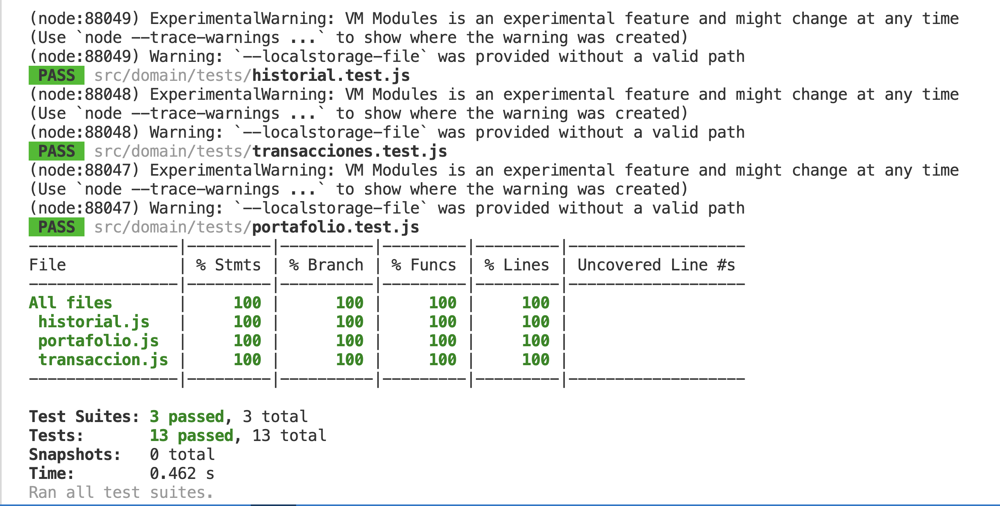

# Informe Académico 2

## Selección de Funcionalidades

### Funcionalidades implementadas

En el presente proyecto se priorizaron cuatro principales funcionalidades. Las cuales son:

- Simulación de compra y venta de venta de distintas acciones.  
  El usuario puede elegir entre las distintas acciones disponibles en el sistema para generar su respectiva compra. No hay un apartado para ingresar dinero, simplemente se asume que siempre tiene la cantidad de dinero válida para ingresar la compra (todo el sistema está en dólares estadounidenses). Una vez realizadas las compras, si se tiene la cantidad disponible, se pueden vender las acciones. Se decidió por parte del equipo además incluir un miniportafolio en esta sección donde el comprador/vendedor pueda ir visualizando en el momento sus acciones, sin tener que moverse a la pestaña de portafolio y facilitarle el trabajo.
- Gestión de portafolio.  
  Esta funcionalidad permite a quienes usan el servicio ver como están rindiendo sus inversiones. En el mismo se dispone de un apartado donde se ve el valor total del patrimonio en inversiones del usuario. La ganancia diaria, el cual es un valor fijo. Y la cantidad de inversiones que se tienen activas, las mismas siempre se mantienen cuando se agrega una nueva inversión, por más que se tenga 0 de alguna.
- Historial de transacciones.  
  Aquí lo que se busca es que la persona que utiliza la web pueda ver todos los movimientos que ha hecho en el sistema, tanto la compra de las acciones, como la venta de la misma.
- Visualización de cotizaciones simuladas.  
  Una simple ventana donde se tiene los datos de las distintas acciones presentes en el sistema. Las mismas poseen el nombre, el valor y si está en aumento o descenso su valor en el mercado. Como por letra se pedía que la investigación no llevara datos extraídos de otros lugares, los valores de las acciones son fijos en todo momento.

Se elegieron estas cuatro funcionalidades principales debido a que eran las que potenciaban el alcance que el equipo le quería dar al proyecto. La idea del equipo era lograr un prgrama lo más intuitivo y amigabile para los usuarios inexperientes en el tema, que son el principal objetivo, y con estas cuatro funcionalidades se vio que, además de ser muy accesibles, también son muy prácticas para comenzar la introducción al tema.  
Además, gracias a las encuestas realizadas, se analizó que es lo que la población prefería para estudiar el tema, y en base a esos análisis se apreció que estos cuatro requerimientos eran los más útiles a incorporar. En su gran mayoría la gente quería aprender a como compra y vender distintas acciones, lo que dio el puntapié a tomar los distintos requerimientos.  
Los seleccionados fueron:

- RF3 - Simulación de compra venta
- RF4: Gestión de portafolio
- RF5 - Historial de transacciones
- RF6: Visualización de cotizaciones simuladas

### Lista priorizada

| Funcionalidades                         | RF  | Prioridad | Justificación                                                                                                                                |
| --------------------------------------- | --- | --------- | -------------------------------------------------------------------------------------------------------------------------------------------- |
| Simulación de compra venta              | RF3 | Alta      | Fue a la que más prioridad se le dio respecto a la necesidades de los usuarios                                                               |
| Gestión de portafolio                   | RF4 | Alta      | Esta funcionalidad también fue una de las que los clientes más querían poder vizualizar, por lo que fue muy importante incorporarla          |
| Historial de transacciones              | RF5 | Media     | Al historial, si bien se le dio su relevancia, no fue algo de mucho hincapié debido a que no es más que reflejar las distintas transacciones |
| Visualización de cotizaciones simuladas | RF6 | Baja      | Si bien esta funcionlidad se incorporó, no se le dio nada de prioridad ya que era solamente mostrar los valores de las acciones              |

### Funcionalidades no implementadas

Uno de los temás más elegidos por nuestra comunidad también fue querer un apartado con imformación dando información para educar un poco sobre el trading, pero eso no fue considerado para el proyecto debido al nivel bajo de complejidad. Esta correspondía al RF8. Esta funcionalidad en un principio se iba a incorporar, luego el docente nos explicó lo mencionado y no se aplicó.  
Todo lo relacionado a la creación de un usuario e inicio de sesión no fue incorporado ya que, primero del todo no se le vio mucha ayuda desde el punto de vista práctico, porque los datos del programa son dinámicos, o sea no se van a guardar en nigún lado por más que haya un usuario asociado. Y en segundo lugar, los integrantes del equipo aún no poseen un conocimiento en bases de datos o backends como para incorporan métodos de almacenamiento de usuarios. Y en la letra del obligatorio se pedía que no se utilizaran además. Si bien en primeras instancias se le había pasado al docente que se iban a incorporar, se tuvo que dar de baja esta funcionalidad por los distintos problemas mencionados. Por lo tanto no se llevaron acabo ni el RF1 ni el RF2.  
Luego, por la misma explicación de que solo puede haber un usuario utilizando el sistema y que los datos no se almacenan en ningún lado, no se pudo ejecutar el RF7, que pretendía hacer un ranking con los mejores usuarios de la aplicación, o sea los que más dinero generaron.  
Finalmente, el RF9, donde se iban a implementar gráficos y métricas de las distintas divisas presentes en el proyecto no fue llevado a cabo por un simple tema de tiempo y de priorización sobre los demás.

---

## Usabilidad y Accesibilidad

En cuanto a la usabilidad, se buscó que la interfaz de usuario fuera lo más clara, simple y fácil de usar posible. Para esto fue clave el uso de Bootstrap, que facilitó ampliamente el desarrollo y permitió cumplir con el objetivo de mantener una apariencia limpia y ordenada.  
La navegación principal se implementó mediante un menú lateral (navbar), ya que resultó ser la opción más intuitiva y agradable visualmente. Esto permitió mantener las diferentes pantallas libres de elementos innecesarios y evitar la sobrecarga de opciones.  
Cada sección fue ubicada dentro de un container con bordes redondeados y sombra, con el fin de mejorar la legibilidad y separar visualmente cada bloque de contenido. Las tarjetas de Compra y Venta, así como las tablas del Historial, se diferenciaron mediante colores verde y rojo respectivamente, lo que permite identificar rápidamente el tipo de operación. Del mismo modo, las tarjetas de Cotizaciones fueron bordeadas con distintos colores para facilitar aún más su reconocimiento.  
Además, se incluyó un mini portafolio dentro de la sección de Compra/Venta, lo que mejoró notablemente la experiencia del usuario. Gracias a esto, ya no es necesario cambiar a la sección de Portafolio para consultar los activos actuales, reduciendo movimientos y haciendo la interacción mucho más fluida.  
En cuanto a la experiencia de usuario, se priorizó que la interacción con la aplicación fuera rápida, intuitiva y sin distracciones. Para lograrlo, se organizaron las secciones de forma lógica, reduciendo la cantidad de pasos necesarios para realizar acciones como comprar, vender o consultar el portafolio.  
El uso de colores diferenciados, iconografía clara y una distribución visual equilibrada ayuda al usuario a identificar rápidamente cada función. Además, la inclusión del mini portafolio dentro de la sección de Compra/Venta mejora la eficiencia, ya que evita cambios constantes entre pantallas. En conjunto, estas decisiones permiten que la navegación sea fluida y que el usuario mantenga siempre el control y la comprensión de lo que está haciendo.  
Capturas de pantallas de nuestra plataforma en uso.  
   
   
   
   
 

### Principios de usabilidad aplicados (Heurísticas de Nielsen)

- Visibilidad del estado del sistema: retroalimentación inmediata en operaciones (mensajes, badges y estados de botones desarrollados en JS).

- Coincidencia entre el sistema y el mundo real: etiquetas y nombres de activos en terminología financiera conocida (BTC, ETH, AAPL, KO).

- Control y libertad del usuario: posibilidad de cancelar/retroceder operaciones en los flujos principales (botones y confirmaciones).

- Consistencia y estándares: componentes Bootstrap y clases reutilizables para mantener interacción homogénea.

- Prevención de errores: validaciones básicas en formularios (tipos, rangos y límites) y mensajes claros de error.

- Reconocimiento mejor que recuerdo: uso de iconos y rótulos explicativos, badges con valores en tiempo real simulados.

- Flexibilidad y eficiencia: diseño responsive que adapta la vista y mantiene accesos rápidos en pantallas pequeñas.

- Estética y minimalismo: interfaz limpia, separación visual entre secciones y jerarquía tipográfica.

- Ayuda para diagnosticar y recuperarse de errores: mensajes de error descriptivos y recomendaciones de corrección.

### Accesibilidad (WCAG AAA — acciones implementadas)

Implementado:

- Atributo lang="es" en el html para indicar idioma del documento.

- Uso de elementos semánticos (header, nav, section, h1–h4) para facilitar navegación por lectores de pantalla.

- Contraste de color revisado en elementos clave (badges y textos) para cumplir en la mayoría de combinaciones.

- Etiquetas y textos alternativos: imágenes principales incluyen alt; todos los botones principales tienen label.

- Componentes keyboard-friendly: offcanvas y toggles se utilizan con atributos ARIA proporcionados por Bootstrap; tab-order lógico.

- Diseño responsive a tamaños y cambios de dispositivos. Pagina valida para telefonos.

---

## Calidad de código

- **Capas del Proyecto**

Capa de Presentación (src/interface/): Contiene index.html con la interfaz que percibe el usuario, un style.css que aunque se uso poco (debido a BootStrap) sigue teniendo algunas funciones y lo mas fundamental el main.js, que es el que maneja y vincula todo.

Capa de Lógica de Negocio (src/domain/): módulos JavaScript independientes que contienen:

Portafolio (cálculos, saldo, activos).

Historial(Listas de compra y venta).

Trasancciones(Constructor que guarda la informacion).

Esta separación permitió:

Testear lógica de negocio sin necesidad de renderizar la UI.

Reutilizar módulos lógicos en diferentes contextos.

Facilitar mantenimiento y correcciones sin afectar la presentación.

Escalabilidad: agregar nuevas funcionalidades sin acoplar componentes.

**Herramientas y procesos**

**Prettier**

Ambas partes del equipo instalaron y eligieron como formateador principal Prettier. La misma es una herramienta de calidad de formateo, que sigue unas reglas preestablecidas para el codigo. Esto produce que el codigo siempre este ordenado, bien indentado y bien espaciado. Consiguiendo asi un proyecto mucho mas prolijo y formal, ayudando a posibles futuros mantenimientos o mejoras.

**Versionado con GIT**

Se sigue GitFlow, con ramas separadas por feature/... para cada integrante trabajar, y luego main, para juntar ambos trabajos en un lugar.
Commits descriptivos, como se menciono en el primer informe se usaron distintas palabras para referenciar a distintos commits, ej: feat, para nuevas funcionalidades. Facilitando asi la rastreabilidad y organizacion.

**Analisis de complejidad**

Se presto fuerte atencion a funciones criticas para mantener una complejidad baja. Esto mejora testabilidad y reduce potenciales bugs.

## Pruebas Unitarias

### Alcance de las prubeas unitarias

Las pruebas unitarias implementadas cubren principalmente las clases del dominio del sistema, responsables de la lógica de negocio, como la simulación de compra y venta de acciones, la gestión del portafolio y el registro de transacciones.
No se incluyen dentro del alcance de las pruebas unitarias los componentes visuales ni la interacción con el usuario, ya que estos corresponden a pruebas de integración o de interfaz.  
Se desarrollaron tres archivos de pruebas unitarias, uno para cada clase principal del dominio: historial.test, portafolio.test y transacciones.test.
Mediante estos tests se busca validar los comportamientos principales del sistema, contemplando casos correctos, errores y casos de borde, con el objetivo de asegurar la correcta funcionalidad de la lógica del negocio y alcanzar una alta cobertura en las clases críticas.  
Dentro de cada uno de ellos se abarcó todas las funciones de cada apartado y todos los posibles casos de las mismas, con la espera de llegar a la mayor cobertura posible.

### Librerías utilizadas

Para el desarrollo y ejecución de las pruebas unitarias se utilizó Node.js como entorno de ejecución y la librería Jest como framework de testing. Jest permitió automatizar la ejecución de las pruebas, validar resultados mediante aserciones y obtener métricas de cobertura del código.

### Cobertura de pruebas

Para las tres clases del dominio el porcentaje de conertura recibido fue del 100% en todo, tanto en las desiciones lógicas, como en las funciones, en las líneas y en las instrucciones. Es decir, que todo el código fue probado. Además de mencionar que se analizaron todos los casos bordes.  
Por lo tanto en general el proyecto tuvo 100% de cobertura en testing.  
En la ejecución de los mismos no se presentó nigún error, lo que indica que todo fue bien planteado.
Y así es como la consola nos dio los resultados de las pruebas:  

---

## Descripción del Trabajo Individual

A continuación, se detalla el aporte de cada integrante del equipo, especificando las tareas realizadas, fechas, horas invertidas y tipo de contribución.

### Aporte de Juan Pagliotti

| Fecha      | Actividad realizada                                       | Tipo de aporte             | Horas    | Responsable    |
| ---------- | --------------------------------------------------------- | -------------------------- | -------- | -------------- |
| 25/11/2025 | Desarrollo de la clase Historial                          | Funcionalidad implementada | 1,5      | Juan Pagliotti |
| 25/11/2025 | Implementación de tests de la clase Historial             | Tests realizados           | 1,5      | Juan Pagliotti |
| 25/11/2025 | Implementación de tests de la clase Portafolio            | Tests realizados           | 1,5      | Juan Pagliotti |
| 25/11/2025 | Diseño de las secciones Inicio, Cotizaciones y Portafolio | Diseño UI/UX               | 2        | Juan Pagliotti |
| 27/11/2025 | Integración de la lógica en el main                       | Funcionalidad implementada | 1,5      | Juan Pagliotti |
| 27/11/2025 | Pruebas unitarias                                         | Documentación              | 0,5      | Juan Pagliotti |
| 27/11/2025 | Funcionalidades implementadas                             | Documentación              | 0,5      | Juan Pagliotti |
| 27/11/2025 | Descripción del trabajo individual                        | Documentación              | 0,5      | Juan Pagliotti |
| 29/11/2025 | Testing del sistema asignado al equipo                    | Testing                    | 1,5      | Juan Pagliotti |
|            | **Total de horas**                                        |                            | **10,5** |                |

### Aporte de Felipe Boix

| Fecha      | Actividad realizada                              | Tipo de aporte             | Horas  | Responsable |
| ---------- | ------------------------------------------------ | -------------------------- | ------ | ----------- |
| 25/11/2025 | Desarrollo de la clase Transacciones             | Funcionalidad implementada | 1,5    | Felipe Boix |
| 25/11/2025 | Desarrollo de la clase Portafolio                | Funcionalidad implementada | 1,5    | Felipe Boix |
| 25/11/2025 | Diseño de las secciones Compra/Venta e Historial | Diseño UI/UX               | 2      | Felipe Boix |
| 27/11/2025 | Integración de la lógica en el main              | Funcionalidad implementada | 2,5    | Felipe Boix |
| 27/11/2025 | Usabilidad y accesibilidad del sistema           | Documentación              | 0,5    | Felipe Boix |
| 27/11/2025 | Calidad de código                                | Documentación              | 0,5    | Felipe Boix |
| 27/11/2025 | Reflexión                                        | Documentación              | 0,5    | Felipe Boix |
| 29/11/2025 | Testing del sistema asignado al equipo           | Testing                    | 1,5    | Felipe Boix |
|            | **Total de horas**                               |                            | **10** |             |

---

## Reflexión

En esta etapa, el equipo mantuvo una comunicación constante a través de Whatsapp y llamadas de Teams para codificar en conjunto. Esto facilitó discutir decisiones rápidamente y resolver dudas en el momento. La organización se basó en dividir las tareas según las fortalezas de cada uno, lo cual hizo más eficiente el trabajo, aunque en algunos momentos generó desalineaciones sobre el estado de ciertos avances. Estas descoordinaciones se resolvieron ajustando la comunicación y revisando en conjunto las partes críticas.  
Los principales desafíos estuvieron en integrar correctamente las partes desarrolladas por separado y asegurar que todas siguieran un mismo criterio técnico. A diferencia de la entrega anterior, se logró una mayor coordinación al momento de unir el trabajo, aprendiendo la importancia de revisar mutuamente el código y mantener un registro claro de lo que se iba completando. Aunque esto por desgracia comenzo a funcionar efectivamente más al final del pryecto, en algunas ocaciones se codificaron dos veces una misma funcion por falta de registros.  
Para las próximas etapas, sería recomendable mejorar la documentación interna, dejar por escrito las decisiones importantes y establecer un proceso más claro de integración y revisión entre ambos integrantes. Esto permitiría reducir retrabajos y aumentar la eficiencia general del equipo.

---
