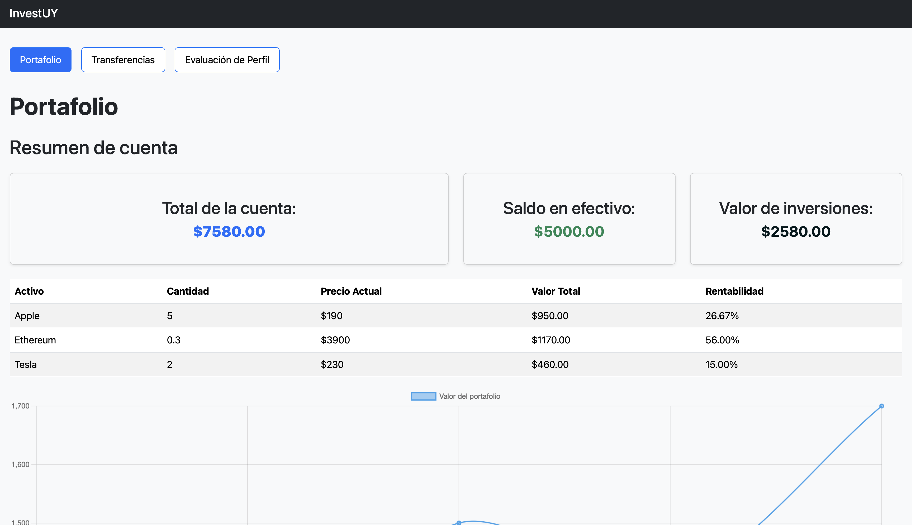
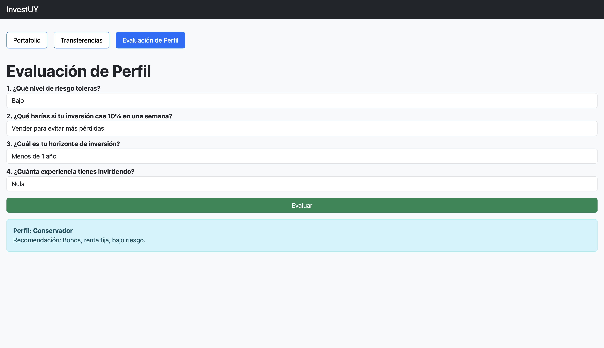
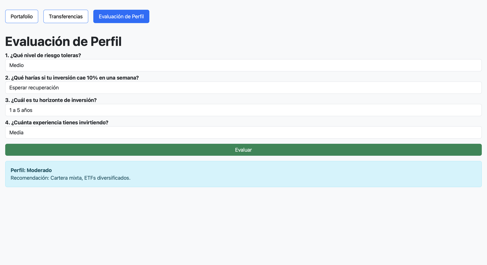
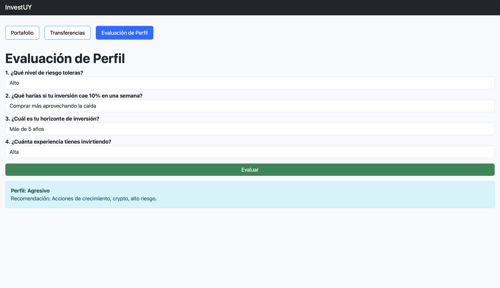
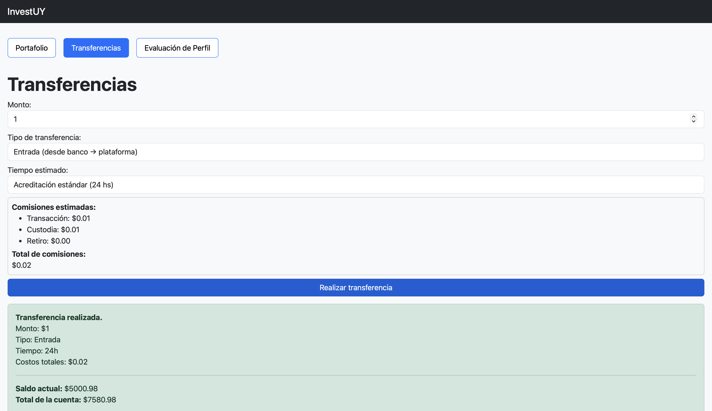
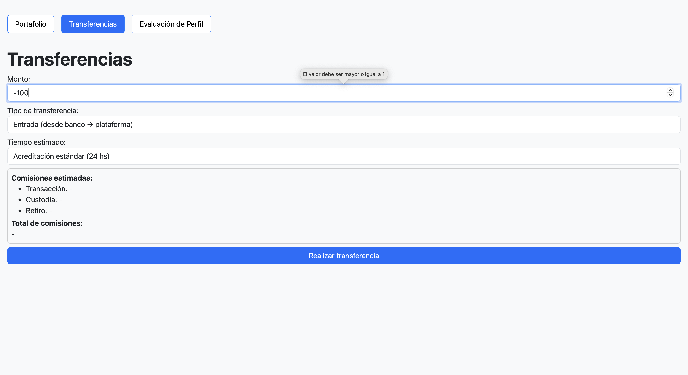
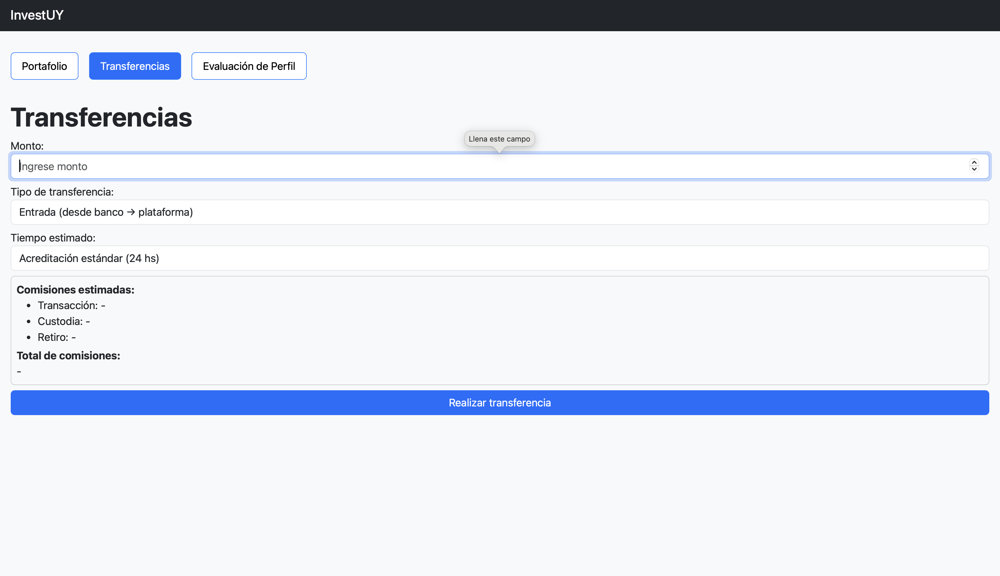
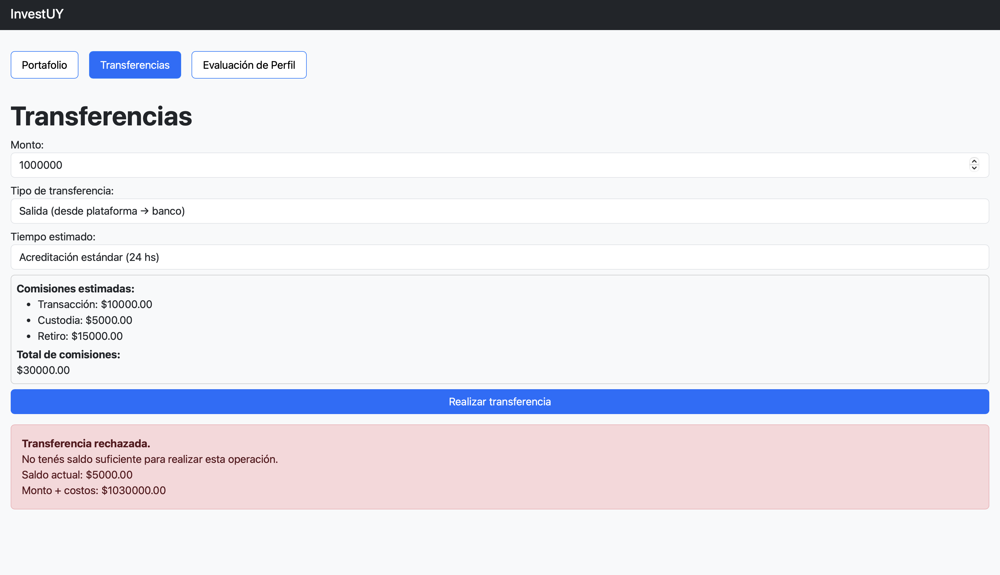

# Informe Testing

- Link a Repositorio Testeado:
  https://github.com/IngSoft-FIS-2025-2/proyecto-casavieja-ciapessoni-dotta

---

## Casos de Prueba

### Configuración del entorno de pruebas

Para realizar los distintos casos de prueba se utilizaron los siguientes entornos

- Dispositivos: Laptop
- Sistemas operativos: Windows y macOS
- Datos de prueba empleados: Para analizar lo máximo posible en el testing funcional no se utilizó ningún archivo con casos de prueba externos, simplemente se analizó los datos de errores y casos bordes manualmente para probar el proyecto, además de casos en circunstancias normales.

### Casos de Prueba

| ID    | Descripción                                            | Datos de entrada                            | Pasos a seguir                                                                      | Resultado esperado                                                                                                                            | Resultado obtenido |
| ----- | ------------------------------------------------------ | ------------------------------------------- | ----------------------------------------------------------------------------------- | --------------------------------------------------------------------------------------------------------------------------------------------- | ------------------ |
| CP-01 | Transferencia de entrada válida                        | Monto: 100, Tipo: Entrada, Tiempo: Estándar | 1. Ir a Transferencias. 2. Ingresar monto 100. 3. Seleccionar Entrada. 4. Confirmar | El saldo en efectivo aumenta en 100 menos la comisión y se registra en el historial. Además sale un aviso debajo notificando la transferencia | Correcto           |
| CP-02 | Transferencia de salida válida                         | Monto: 50, Tipo: Salida, Tiempo: Estándar   | 1. Realizar una transferencia de salida con saldo suficiente                        | El saldo disminuye en 50 más la comisión y se registra en el historial. Además sale un aviso debajo notificando la transferencia              | Correcto           |
| CP-03 | Transferencia con monto 0 (dato inválido)              | Monto: 0, Tipo: Entrada o Salida            | 1. Ingresar monto 0. 2. Enviar formulario                                           | El sistema no permite continuar y muestra error                                                                                               | Correcto           |
| CP-04 | Transferencia con monto negativo (dato inválido)       | Monto: -100, Tipo: Entrada o Salida         | 1. Ingresar un monto negativo. 2. Confirmar                                         | El sistema no permite continuar y muestra error                                                                                               | Correcto           |
| CP-05 | Transferencia con un monto tipo string (dato inválido) | Monto: "hola", Tipo: Entrada o Salida       | 1. Ingresar un monto tipo string. 2. Confirmar                                      | El sistema no permite continuar y muestra error                                                                                               | Correcto           |
| CP-06 | Transferencia con un monto vacío (dato inválido)       | Monto: , Tipo: Entrada o Salida             | 1. Ingresar un monto nulo. 2. Confirmar                                             | El sistema no permite continuar y muestra error                                                                                               | Correcto           |
| CP-07 | Transferencia con monto 1 (caso borde)                 | Monto: 1, Tipo: Entrada o Salida            | 1. Ingresar monto 1                                                                 | El saldo en efectivo aumenta en 1 menos la comisión y se registra en el historial. Además sale un aviso debajo notificando la transferencia   | Correcto           |
| CP-08 | Retiro mayor al saldo disponible (error)               | Monto: 10000, Tipo: Salida                  | 1. Intentar retirar más dinero del disponible                                       | El sistema rechaza la operación                                                                                                               | Correcto           |
| CP-09 | Visualización del portafolio sin inversiones           | Sin inversiones                             | 1. Ingresar a Portafolio sin operaciones previas                                    | El sistema muestra valores en 0 para todo lo perteneciente al portafolio, incluyendo la lista de tranacciones                                 | Falló              |
| CP-10 | Evaluación de perfil conservador                       | Respuestas todas las más bajas              | 1. Completar formulario con opciones de bajo riesgo                                 | El sistema muestra perfil conservador                                                                                                         | Correcto           |
| CP-11 | Evaluación de perfil agresivo                          | Respuestas todas las más altas              | 1. Completar formulario con opciones de alto riesgo                                 | El sistema muestra perfil agresivo                                                                                                            | Correcto           |
| CP-12 | Evaluación de perfil moderado                          | Respuestas todas las medias                 | 1. Completar formulario con opciones de medio riesgo                                | El sistema muestra perfil moderado                                                                                                            | Correcto           |

---

## Sesiones de Prueba Exploratoria

### Sesión de Testing Exploratorio – Sesión 1

**MISIÓN**  
Validar la navegación general del sistema y la correcta visualización del Portafolio, incluyendo resumen de cuenta, gráfico y listado de transferencias.

**INICIO Y FIN**

- Inicio: 15/11/2025 – 16:00 hs
- Fin: 15/11/2025 - 16:30 hs

**TESTER**  
Juan Pagliotti

**ESTRUCTURA DE DIVISIÓN – DURACIÓN: Corta (30’)**

- Diseño y ejecución de pruebas: 70%
- Investigación y reportes de defectos: 20%
- Armado de la sesión: 10%

**OBJETIVO vs. OPORTUNIDAD:**  
90 / 10

**ARCHIVOS DE DATOS**  
No fue utilizado ningún archivo de datos externo, solo:

- Datos simulados de transferencias de prueba
- Saldos iniciales del sistema

**NOTAS DE PRUEBAS**

- [Prueba #1]: Verificación de correcta carga del resumen de cuenta al iniciar la aplicación.  
  Al iniciar la aplicación no se presenta ningún tipo de problema ni de carga de datos iniciales ni de bugs en la interfaz. Todo se ve de manera instantánea y clara.
- [Prueba #2]: Navegación entre pestañas (Portafolio, Transferencias, Evaluación de Perfil).  
  Al navegar entre las distintas pestañas todo se efectúa de manera instantanea y sin retardos de ningún tipo. Todo se hace de forma fluída y no se cae nada dentro del sistema. Los datos se mantienen al intercambiar secciones y al agregar también se actualizan todas las partes.
- [Prueba #3]: Prueba del sistema en distintos browsers y sistemas operativos.  
  La página web se vizualiza de igual proporción en todos los navegadores utilizados. No presenta cambios, inconsistencias o variaciones de estilo al cambiar de browser ni de sistema operativo.
- [Prueba #4]: Visualización del historial vacío de transferencias y actualización tras una operación.  
  Al abrir la aplicación el historial de transacciones se encontraba vacío y en el momento en que se efectuó una transferencia la misma se agregó.

**DEFECTOS**  
Al finalizar las sesiones de testing exploratorio no se identificaron defectos funcionales. Todas las funcionalidades probadas se comportaron de acuerdo a lo esperado.

**INCONVENIENTES**

- Al abrir la aplicación, en el portafolio no se muestran todos los datos vacíos, lo cual uno esperaría que fuese así en primera instancia.

**MÉTRICAS DE TESTING EXPLORATORIO**

1. Misión vs Oportunidad: **90 / 10**
2. Investigación y reporte: **20%**
3. Diseño y ejecución: **70%**
4. Configuración de las pruebas: **10%**

**EVIDENCIAS**

- [Prueba #3] MacOS y Windows, respectivamente.  
  
  

### Sesión de Testing Exploratorio – Sesión 2

**MISIÓN**  
Validar el correcto funcionamiento de las operaciones de compra y venta válidas del sistema, considerando todas las variantes posibles de ejecución.

**INICIO Y FIN**

- Inicio: 30/11/2025 – 17:15 hs
- Fin: 30/11/2025 – 17:52 hs

**TESTER**  
Felipe Boix

**ESTRUCTURA DE DIVISIÓN – DURACIÓN: Corta (37 minutos)**

- Diseño y ejecución de pruebas: 70%
- Investigación y reporte de defectos: 20%
- Configuración de la sesión: 10%

**OBJETIVO vs. OPORTUNIDAD:**  
90 / 10

**ARCHIVOS DE DATOS**  
No se utilizaron archivos de datos externos durante esta sesión.

**NOTAS DE PRUEBAS**

- [Prueba #1]: Validación de compra inicial con cantidad específica.  
  Se ejecutó una compra inicial por $360 USD. El sistema procesó correctamente la operación, actualizando el saldo disponible y aplicando las comisiones correspondientes de forma precisa.

- [Prueba #2]: Validación de venta con cantidad específica.  
  Se ejecutó una operación de venta por $360 USD con saldo disponible suficiente. El sistema procesó correctamente la transacción, reduciendo el saldo y aplicando las comisiones aplicables sin discrepancias.

- [Prueba #3]: Validación de tiempos de acreditación (24 y 48 horas).  
  Se verificó que la plataforma ejecuta correctamente operaciones de compra y venta independientemente del tiempo de acreditación seleccionado. Ambas opciones funcionaron conforme a lo especificado.

- [Prueba #4]: Validación de transferencia instantánea con comisión incrementada.  
  Se comprobó que las operaciones instantáneas aplican correctamente una comisión superior. La transacción se procesó exitosamente con los valores ajustados correspondientes.

**DEFECTOS**  
Al finalizar la sesión de testing exploratorio no se identificaron defectos funcionales críticos. Todas las funcionalidades evaluadas se comportaron de acuerdo con los resultados esperados.

**INCONVENIENTES**

- Durante la fase inicial de la sesión no fue posible discriminar claramente la diferencia conceptual entre "Total de la cuenta" y "Saldo en efectivo". Posteriormente se estableció que esta diferencia radica en la valorización de los activos adquiridos.

**MÉTRICAS DE TESTING EXPLORATORIO**

1. Misión vs Oportunidad: **90 / 10**
2. Investigación y reporte: **20%**
3. Diseño y ejecución: **70%**
4. Configuración de las pruebas: **10%**

**EVIDENCIAS**

- [Prueba #1]  
  
  

## Sesión de Testing Exploratorio – Sesión 3

**MISIÓN**  
Validar el correcto funcionamiento de la evaluación del perfil de riesgo del usuario y verificar el comportamiento del sistema ante casos límite, errores de entrada y situaciones extremas de uso.

**INICIO Y FIN**

- Inicio: 15/11/2025 – 17:00 hs
- Fin: 15/11/2025 – 17:30 hs

**TESTERS**  
Juan Pagliotti y Felipe Boix

**ESTRUCTURA DE DIVISIÓN – DURACIÓN: Corta (30’)**

- Diseño y ejecución de pruebas: 70%
- Investigación y reportes de defectos: 20%
- Armado de la sesión: 10%

**OBJETIVO vs. OPORTUNIDAD:**  
90 / 10

**ARCHIVOS DE DATOS**  
No fue utilizado ningún archivo de datos externo. Se emplearon únicamente:

- Datos simulados de transferencias de prueba.
- Saldos iniciales generados por el sistema.

**NOTAS DE PRUEBAS**

- [Prueba #1]: Evaluación de perfil conservador.  
  Se completó el formulario con todas las opciones de bajo riesgo (riesgo bajo, vender ante caída, horizonte corto, experiencia nula). El sistema devolvió correctamente un perfil conservador.

- [Prueba #2]: Evaluación de perfil moderado.
  Se ingresaron respuestas intermedias en todas las preguntas. El sistema mostró un perfil moderado acorde a los datos ingresados.

- [Prueba #3]: Evaluación de perfil agresivo.  
  Se seleccionaron todas las opciones de alto riesgo (riesgo alto, comprar ante caída, horizonte largo, experiencia alta). El sistema respondió con un perfil agresivo correctamente.

- [Prueba #4]: Envío repetido del formulario de evaluación.  
  Se envió un mismo formulario de evaluación varias veces consecutivas. El sistema actualizó correctamente el resultado sin duplicar mensajes ni generar errores visuales.

- [Prueba #5]: Transferencia con monto mínimo permitido (entrada o salida).  
  Se ingresó un monto de 1 como transferencia de entrada. El sistema permitió la operación y registró correctamente el movimiento.

- [Prueba #6]: Transferencia con monto 0 (entrada o salida).  
  El sistema bloqueó correctamente la operación, evitando la ejecución con un valor inválido, mostrando un cartel para ingresar valor mayor o igual a 1.

- [Prueba #7]: Transferencia con monto negativo (entrada o salida).  
  El sistema rechazó correctamente la operación al ingresar un valor negativo.
  El sistema bloqueó correctamente la operación, evitando la ejecución con un valor inválido, mostrando un cartel para ingresar valor mayor o igual a 1.

- [Prueba #8]: Transferencia con monto nulo (entrada o salida).  
  El sistema bloqueó correctamente la operación, evitando la ejecución con un valor inválido, mostrando un cartel para ingresar un valor.

- [Prueba #9]: Transferencia con monto tipo string (entrada o salida).  
  El sistema rechazó correctamente la operación al ingresar un número.

- [Prueba #10]: Retiro mayor al saldo disponible.  
  Se intentó retirar un monto superior al saldo disponible. El sistema no permitió la operación y mostró un mensaje de error.

- [Prueba #11]: Transferencia con monto extremadamente alto.  
  Se ingresó un monto elevado para verificar el comportamiento del sistema. La operación se procesó sin afectar la estabilidad del sistema.

- [Prueba #12]: Recarga de la página durante una operación.  
  Se recargó la página durante el uso del sistema. El sistema volvió a su estado inicial sin romper la interfaz y se borraron todos los datos.

**DEFECTOS**  
Al finalizar la sesión de testing exploratorio no se identificaron defectos funcionales críticos. Todas las funcionalidades probadas se comportaron de acuerdo con los resultados esperados.

**INCONVENIENTES**  
No se detectó ningún tipo de inconveniente en esta sección de testing exploratorio.

**MÉTRICAS DE TESTING EXPLORATORIO**

1. Misión vs Oportunidad: **90 / 10**
2. Investigación y reporte: **20%**
3. Diseño y ejecución: **70%**
4. Configuración de las pruebas: **10%**

**EVIDENCIAS**  
  
  
  
  
  
  
  
  
  

---

## Reporte de Issues

Durante la ejecución de las sesiones de testing exploratorio y la confección de los casos de prueba, no se detectaron defectos funcionales, errores críticos ni inconvenientes de usabilidad que ameriten la apertura de un issue en la plataforma de seguimiento.
Todas las funcionalidades evaluadas se comportaron de acuerdo a lo esperado, nada falló.

### Sumario de Issues

| Tipo de issue | Cantidad |
| ------------- | -------- |
| Bugs          | 0        |
| Mejoras       | 0        |
| Documentación | 0        |
| **Total**     | **0**    |

### Clasificación por Severidad

| Severidad | Cantidad |
| --------- | -------- |
| Crítico   | 0        |
| Mayor     | 0        |
| Menor     | 0        |
| **Total** | **0**    |

### Referencias a Issues

No fue detectado nigún issue o bug en el transcurso del testing, pero igualmente se generó un link a un issue explicando lo sucedido para cumplir con la letra.  
Se puede acceder al mismo a través del siguiente link: https://github.com/IngSoft-FIS-2025-2/proyecto-casavieja-ciapessoni-dotta/issues/2

---

## Evaluación Global de Calidad

A partir de la ejecución de las sesiones de testing exploratorio y los casos de prueba realizados, se obtuvo una visión general del estado actual del software. La evaluación se basa en la evidencia recolectada durante las pruebas funcionales, de usabilidad y de confiabilidad.

### Funcionalidad

El sistema cumple correctamente con las funcionalidades principales definidas en los requisitos.  
Las acciones básicas se ejecutan de forma esperada y no se detectaron fallos críticos que impidan el uso normal del software.

- Las funciones principales responden correctamente ante datos válidos.
- Se validan adecuadamente todos los datos ingresados.
- No se encontraron errores corresponden a casos de borde o validaciones incompletas.
- No se encontraron issues o bugs en el mismo.

### Usabilidad y Accesibilidad

La interfaz resulta clara e intuitiva para el usuario. La navegación es simple y las acciones más importantes son fáciles de identificar.

- La disposición de botones y opciones es comprensible.
- El sistema es fácil de aprender para usuarios nuevos.
- Los mensajes de error son entendibles.
- El diseño es consistente a lo largo de las pantallas y no presenta trabas en el intercambio de los mismos.

### Confiabilidad

Durante las pruebas realizadas, el sistema mostró un comportamiento estable.

- No se produjeron cierres inesperados.
- No se detectaron fallas graves de ejecución.
- El sistema responde de manera consistente ante las mismas acciones.
- El único inconveniente detectado no compromete la integridad general del sistema.

El sistema está muy bien logrado y no hay casi nada para opinar. Solo como recomendación se podría inicializar el saldo de la cuenta y todo lo relacionado a las estadísticas y ganancias en 0 para que el usuario tenga una experiencia al 100% desde el inicio.

---
